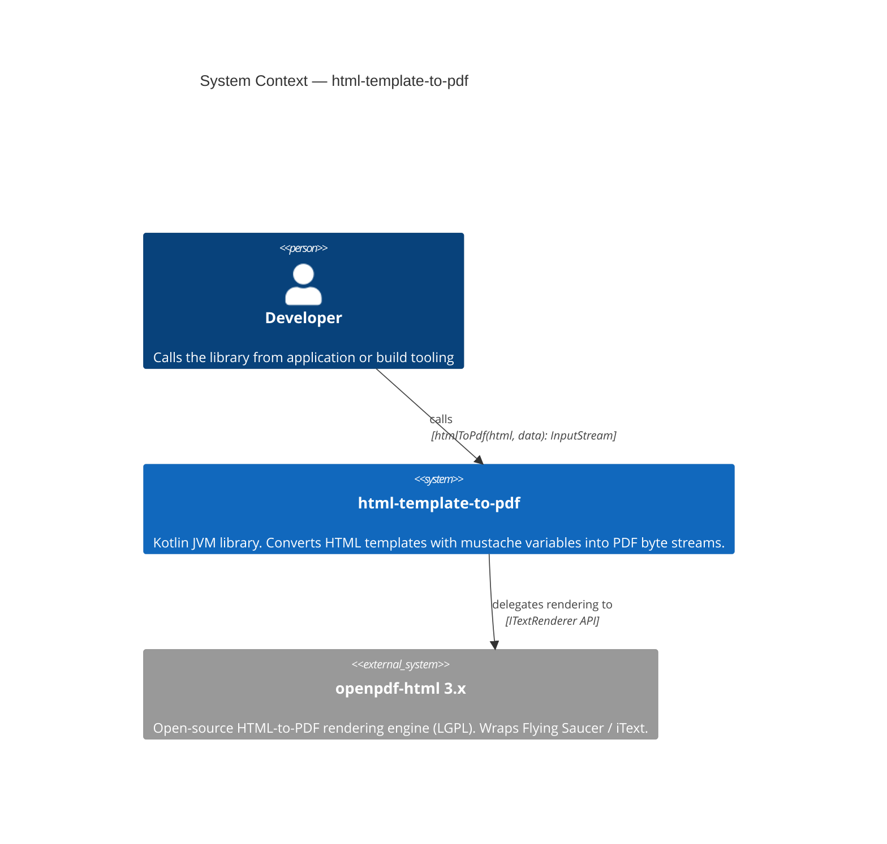
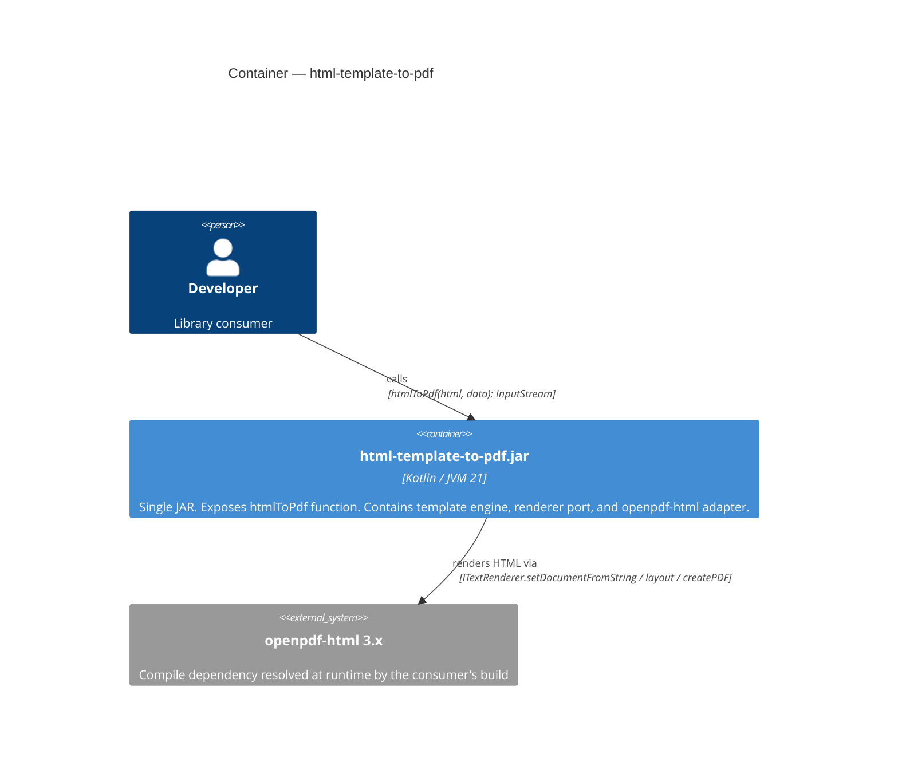
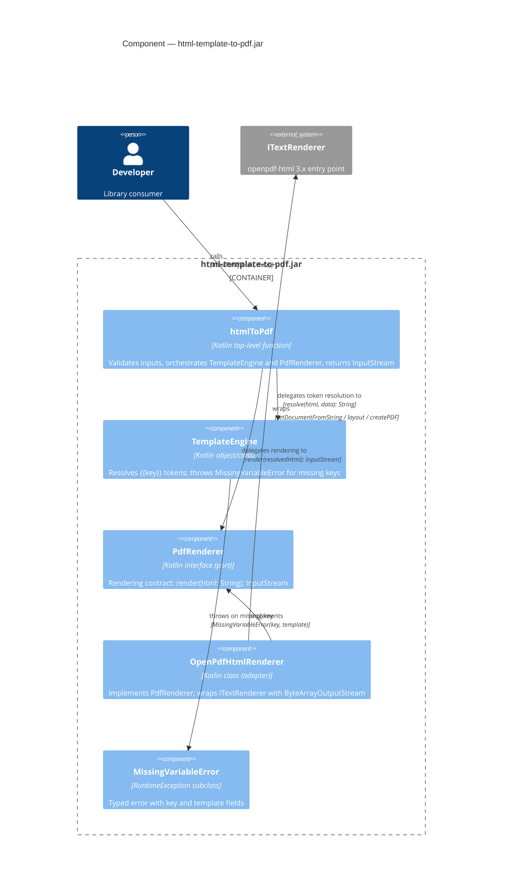

# Architecture Design: html-template-to-pdf

## Executive Summary

`html-template-to-pdf` is a Kotlin JVM library that accepts an HTML string with optional mustache-style variables, resolves those variables, and returns the rendered PDF as an `InputStream`. The renderer boundary is protected by a port interface so the underlying `ITextRenderer` (openpdf-html) can be replaced or mocked without touching the public API.

---

## Quality Attribute Decisions

| Attribute | Strategy |
|---|---|
| **Testability** | `PdfRenderer` interface (port) isolates `ITextRenderer` from unit tests; `TemplateEngine` is pure logic with no I/O |
| **Minimal footprint** | No fat JAR, no CLI, no server; compile-time dependencies are one library plus `slf4j-api` |
| **Maintainability** | Single package `io.htmltopdf`; components have single responsibilities; engine swap requires only a new adapter |
| **Reliability** | Fail-fast variable validation before rendering; descriptive typed errors |

---

## Component Responsibilities

| Component | Responsibility |
|---|---|
| `htmlToPdf` (public fn) | Entry point: validates inputs, orchestrates `TemplateEngine` then `PdfRenderer`, returns `InputStream` |
| `TemplateEngine` | Replaces `{{key}}` tokens with values from `data`; throws `MissingVariableError` for unresolved tokens |
| `PdfRenderer` (interface/port) | Defines the rendering contract: accepts resolved HTML string, returns `InputStream` |
| `OpenPdfHtmlRenderer` (adapter) | Implements `PdfRenderer` using `ITextRenderer`; owns the `ByteArrayOutputStream` wrapping |
| `MissingVariableError` | Typed exception carrying `key` and `template` fields for diagnostic precision |

---

## Dependency Flow

```
Caller
  │
  ▼
htmlToPdf(html, data)          ← public API surface
  │
  ├──► TemplateEngine          ← pure logic, no I/O
  │      └── resolvedHtml
  │
  └──► PdfRenderer (port)      ← dependency-inverted boundary
         │
         ▼
       OpenPdfHtmlRenderer     ← adapter (implements port)
              │
              ▼
         ITextRenderer         ← openpdf-html 3.x (external)
```

Dependencies point inward: `OpenPdfHtmlRenderer` depends on the `PdfRenderer` interface, not the reverse.

---

## C4 System Context Diagram



---

## C4 Container Diagram



---

## C4 Component Diagram



---

## Integration Checkpoints (DISCUSS wave mapping)

| ICP | Description | Owning Component |
|---|---|---|
| ICP-01 | Plain HTML string passes through without modification | `htmlToPdf` → `PdfRenderer` (no `TemplateEngine` call when `data` is empty and no tokens present) |
| ICP-02 | `{{key}}` tokens resolved from `data` map | `TemplateEngine.resolve()` |
| ICP-03 | Missing key throws `MissingVariableError` before render | `TemplateEngine.resolve()` |
| ICP-04 | Rendered PDF bytes are returned as `InputStream` | `OpenPdfHtmlRenderer` (ByteArrayInputStream wrapping) |
| ICP-05 | Empty or blank HTML string rejected before rendering | `htmlToPdf` input validation |

---

## Error Handling Strategy

- **Input validation** (empty/blank HTML): `IllegalArgumentException` thrown by `htmlToPdf` before any processing.
- **Missing template variable**: `MissingVariableError` (typed, extends `RuntimeException`) thrown by `TemplateEngine` before the renderer is invoked. Carries `key` and `template` for diagnostics.
- **Renderer failure**: any exception from `ITextRenderer` propagates unwrapped; the adapter does not swallow renderer exceptions.
- **No silent failures**: every invalid state surfaces as a typed, descriptive exception.

---

## Walking Skeleton Implementation Path

**Feature 0 — Plain HTML to PDF (no variable injection)**

1. Define `PdfRenderer` interface with `render(html: String): InputStream`.
2. Implement `OpenPdfHtmlRenderer`: `ITextRenderer()` → `setDocumentFromString(html)` → `layout()` → `createPDF(baos)` → return `ByteArrayInputStream(baos.toByteArray())`.
3. Implement `htmlToPdf(html, data = emptyMap())`: validate non-blank, call `renderer.render(html)`, return result.
4. Acceptance: calling `htmlToPdf("<html><body>Hello</body></html>")` returns a non-empty `InputStream` whose bytes begin with `%PDF`.

Variable injection (`TemplateEngine` + `MissingVariableError`) is introduced in Feature 1, layered on top of the skeleton without modifying the port or adapter.
