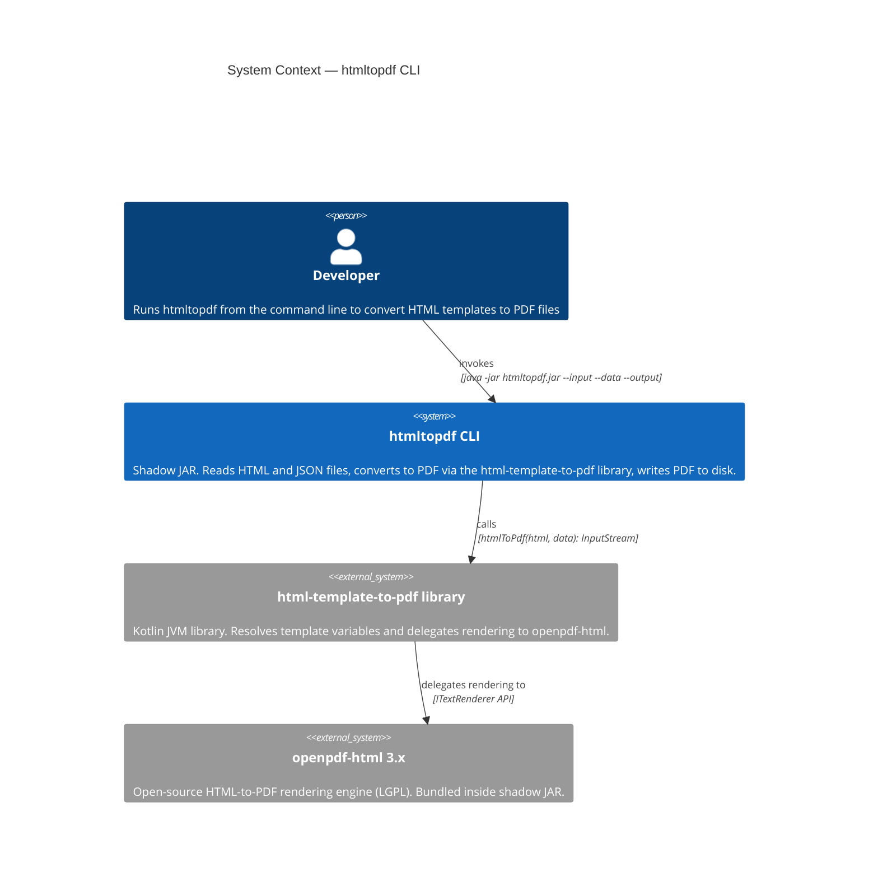
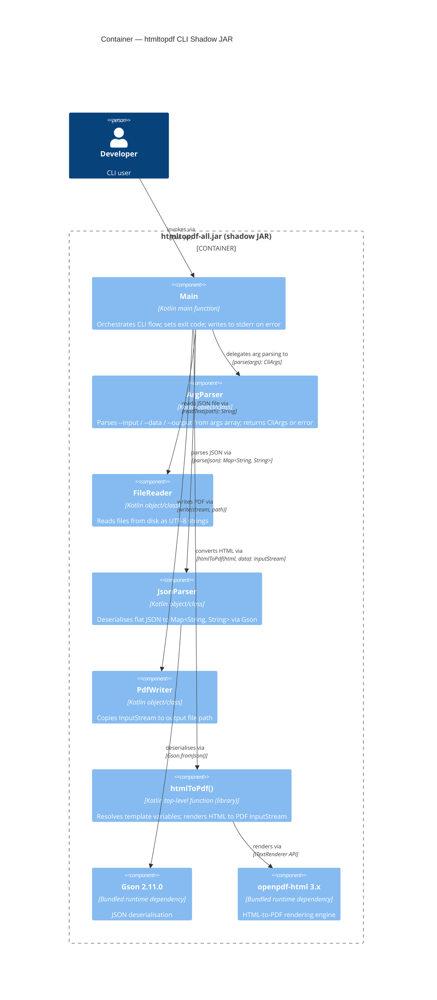

# Architecture Design: htmltopdf CLI

Version: 1.0
Date: 2026-03-18
Feature: htmltopdf CLI (`--input` / `--data` / `--output`)

---

## Executive Summary

The `htmltopdf` CLI wraps the existing `io.htmltopdf.htmlToPdf` library function in a command-line interface. It reads an HTML template from a file, optionally reads a flat JSON data file, invokes the library, and writes the resulting PDF to a file. The CLI is distributed as a shadow (fat) JAR — a single self-contained executable artifact.

No changes are made to the library's public API. The CLI lives in a new package (`io.htmltopdf.cli`) inside the existing single-project Gradle build.

---

## Architecture Decision Summary

| Decision | Choice | Rationale |
|---|---|---|
| Project structure | Single-project, new package | Avoids restructuring existing source; CLI is not independently deployable |
| Argument parsing | Manual `args: Array<String>` parsing | Only 3 flags; no framework dependency justified |
| JSON parsing | Gson 2.11.0 | Single method call for flat `Map<String, String>`; minimal footprint |
| Distribution | Shadow (fat) JAR via shadow plugin | NFR-01: single self-contained executable; standard Gradle solution |
| Library coupling | Direct call to `htmlToPdf()` | No API changes; CLI is a thin adapter over the existing function |

---

## Component Responsibilities

| Component | Package | Responsibility |
|---|---|---|
| `Main` (main fn) | `io.htmltopdf.cli` | Entry point: orchestrates arg parsing, file I/O, library call, exit codes |
| `ArgParser` | `io.htmltopdf.cli` | Validates and extracts `--input`, `--data`, `--output` from `args` |
| `FileReader` | `io.htmltopdf.cli` | Reads HTML and JSON files from disk (UTF-8) |
| `JsonParser` | `io.htmltopdf.cli` | Parses flat JSON object into `Map<String, String>` via Gson |
| `PdfWriter` | `io.htmltopdf.cli` | Writes `InputStream` to an output file path |
| `htmlToPdf()` | `io.htmltopdf` | Existing library function — unchanged |

---

## Error Handling Flow

```
parse args
    │
    ├─ missing/unknown flag ──────────────────────────────► stderr + exit 1
    ▼
read --input file
    │
    ├─ file not found / unreadable ──────────────────────► stderr + exit 1
    ▼
read --data file (if provided)
    │
    ├─ file not found / unreadable ──────────────────────► stderr + exit 1
    ├─ JSON is not a flat object ────────────────────────► stderr + exit 1
    ▼
call htmlToPdf(html, data)
    │
    ├─ MissingVariableError ─────────────────────────────► stderr + exit 1
    ├─ any other exception ──────────────────────────────► stderr + exit 1
    ▼
write PDF to --output file
    │
    ├─ output path not writable ─────────────────────────► stderr + exit 1
    ▼
exit 0 (silent stdout)
```

---

## C4 System Context Diagram



---

## C4 Container Diagram



---

## Integration with Existing Library

### Function called

```
io.htmltopdf.htmlToPdf(
    html: String,
    data: Map<String, String> = emptyMap(),
    renderer: PdfRenderer = OpenPdfHtmlRenderer()
): InputStream
```

The CLI always uses the default `renderer` parameter. No custom renderer is injected.

### Exceptions caught by the CLI

| Exception | Source | CLI response |
|---|---|---|
| `IllegalArgumentException` | `htmlToPdf` — blank HTML guard | stderr message + exit 1 |
| `MissingVariableError` | `TemplateEngine` — unresolved `{{key}}` token | stderr message + exit 1 |
| `Exception` (catch-all) | `OpenPdfHtmlRenderer` / unexpected | stderr message + exit 1 |

The CLI does not suppress or swallow exceptions. All error paths write to `stderr` and exit with code 1.

---

## Build Changes Required

### 1. Apply shadow plugin

```kotlin
// build.gradle.kts
plugins {
    kotlin("jvm") version "2.1.0"
    id("com.github.johnrengelman.shadow") version "8.1.1"
}
```

### 2. Add Gson dependency

```kotlin
dependencies {
    implementation("com.google.code.gson:gson:2.11.0")
    // ... existing dependencies unchanged
}
```

### 3. Configure shadow JAR manifest

```kotlin
tasks.shadowJar {
    manifest {
        attributes["Main-Class"] = "io.htmltopdf.cli.MainKt"
    }
    archiveClassifier.set("all")
}
```

The shadow JAR bundles all runtime dependencies (Gson, openpdf-html, and transitive deps) into a single artifact. The existing `jar` task produces the library JAR (unchanged). The shadow task produces `htmltopdf-all.jar`.
